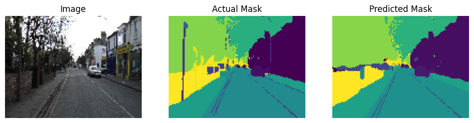

# Traffic Image Segmentation using U-Net

## Overview
This project implements a U-Net convolutional neural network from scratch using TensorFlow for semantic segmentation of traffic scenes. The model performs pixel-wise classification to identify important road elements such as lanes and vehicles.

## Problem Statement
Given a traffic scene image, the objective is to generate a segmentation mask highlighting key regions such as roads, vehicles, and lane boundaries.

## Architecture
- Encoder–Decoder architecture (U-Net)
- Convolution + MaxPooling for feature extraction
- Skip connections for spatial feature preservation
- Pixel-wise binary / multi-class segmentation

## Tech Stack
- Python
- TensorFlow / Keras
- NumPy
- OpenCV / PIL
- Matplotlib

## Training Details

- Dataset: CamVid dataset (Kaggle)
- Images: ~700+ labeled traffic scene images
- Input Resolution: 96x128
- Epochs: 100
- Optimizer: Adam
- Loss Function: Sparse Categorical Crossentropy

## Results

<p align="center">
  
</p>

### The model successfully segments road lanes and vehicles while preserving spatial details through skip connections.

## Performance

- Training Accuracy: 94%
- Test Accuracy: 82%
- Dataset: CamVid
- Task: Pixel-wise semantic segmentation

## Key Learnings
- Implemented U-Net architecture from scratch
- Built end-to-end training pipeline
- Applied data preprocessing and augmentation
- Optimized segmentation performance through hyperparameter tuning

## Setup Instructions

```bash
git clone <repo-link>
cd traffic-image-segmentation
pip install -r requirements.txt
python Traffic-Image-Segmentation.py